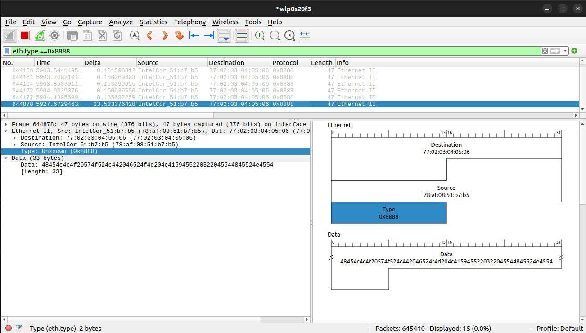

# Layer 2 Frame Generator (C)

A lightweight C utility to generate and transmit custom Ethernet (Layer 2) frames directly onto the wire using raw sockets. This tool allows for the specification of custom EtherTypes and payloads, making it ideal for network protocol testing and educational purposes.

## Features
- **Raw Socket Transmission**: Bypasses the standard TCP/IP stack to send frames directly.
- **Custom EtherType**: Easily define your own protocol identifiers.
- **Hardware Address Retrieval**: Automatically fetches the source MAC address and interface index using `ioctl`.
- **Custom Payloads**: Supports arbitrary string or binary payloads.

## Prerequisites
- **Operating System**: Linux (Raw sockets `AF_PACKET` are Linux-specific).
- **Privileges**: Root/Sudo access is required to open raw sockets.

## Getting Started

### 1. Configuration
Open `l2frame.c` and modify the following variables to match your environment:
- `interface`: The name of your network interface (e.g., `eth0`, `wlan0`).
- `dst_mac_str`: The destination MAC address.
- `ethtype`: Your custom EtherType (e.g., `0x8888`).
- `payload`: The data you wish to transmit.

### 2. Compilation
Compile the program using `gcc`:
```bash
gcc l2frame.c -o l2
```

### 3. Execution
Run the executable with `sudo`:
```bash
sudo ./l2
```

## Wireshark Verification
To verify the transmission, capture traffic on the specified interface using Wireshark. Filter by your custom EtherType (e.g., `eth.type == 0x8888`).

### Screenshots
*Attach your Wireshark capture here to demonstrate the frame structure.*




## Project Structure
- `l2frame.c`: Main source code.
- `l2`: Compiled executable.

## License
MIT License
